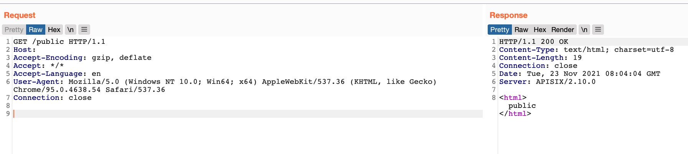
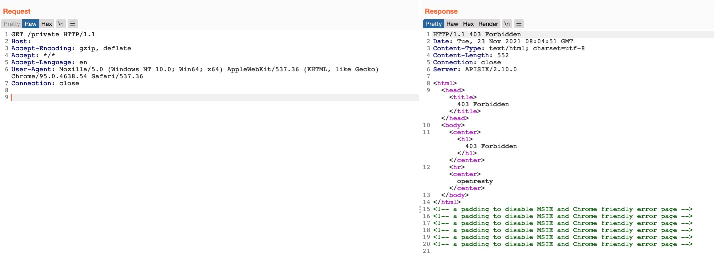

# README

```
./start.sh

# 关闭
docker-compose rm -fs
```

规则
```
"block_rules": ["^/private(/?).*"]
```

访问 `/public` ，访问到后端的 public




访问 `/private` ，触发 block_rules 策略，被拦截。


绕过


具体可参考 [Apache APISIX uri-blocker 场景绕过之一：$request_uri](https://articles.zsxq.com/id_6owftl6j1iw8.html)

# Reference

