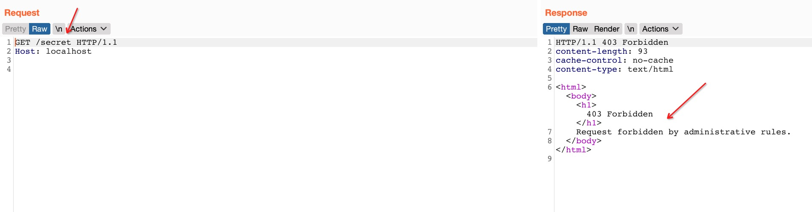
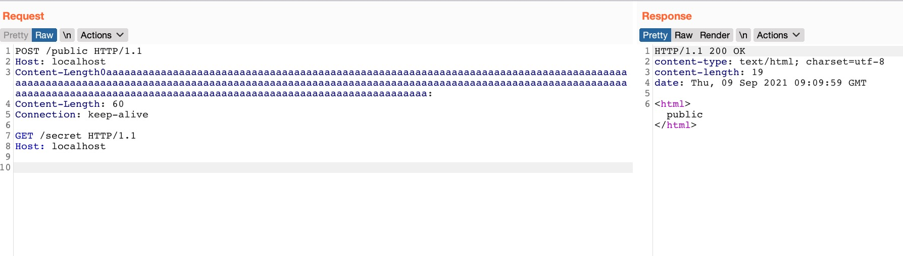
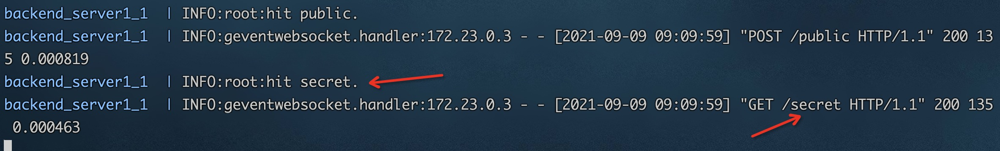

# README

```
./start.sh

# 关闭
docker-compose rm -fs
```

访问 secret，被 HAProxy策略 403


绕过



具体分析见 [HAProxy 场景绕过之一: CVE-2021-40346 Content-Length 整型溢出与HTTP Request Smuggling](https://t.zsxq.com/vjIEUfq)