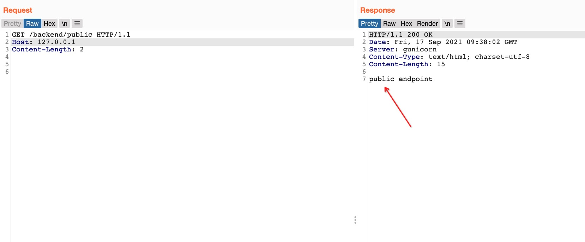
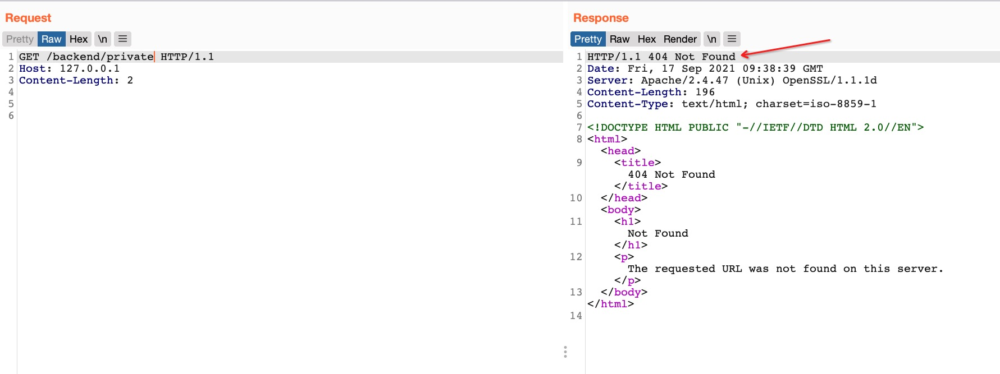
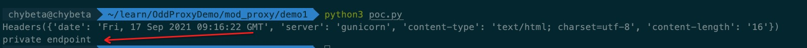

# README

```
./start.sh

# 关闭
docker-compose rm -fs
```

规则
```
ProxyPassMatch "/backend/private" !
ProxyPass "/backend" http://backend_server1:5000
```

访问 `/backend/public` ，触发 Apache httpd 的 ProxyPass 策略，访问到后端的 public




访问 `/backend/private` ，触发 Apache httpd 的 ProxyPassMatch 策略，被拦截没有转发


绕过


具体可参考 [Apache Module mod_proxy 场景绕过之一: Request Method white spaces](https://t.zsxq.com/eiM37Y3)

# Reference
https://httpd.apache.org/security/vulnerabilities_24.html