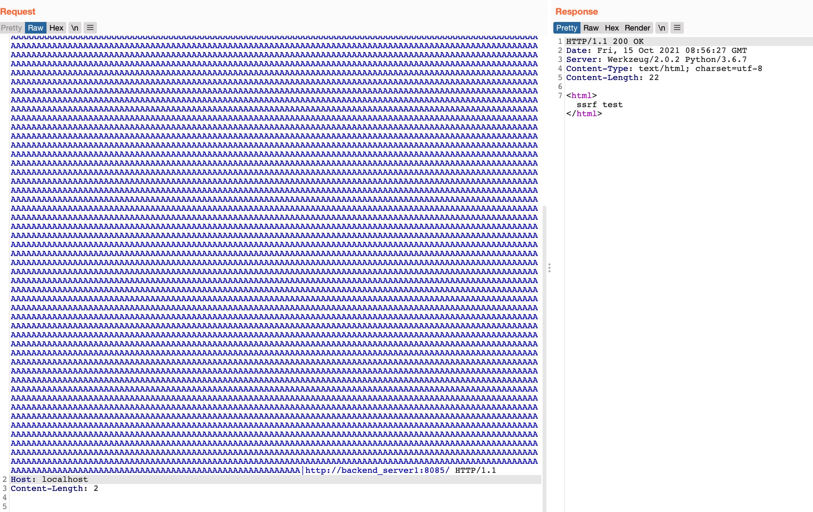

# README

```
./start.sh

# 关闭
docker-compose rm -fs
```

规则
```
ProxyPass / http://www.baidu.com/
ProxyPassReverse / http://www.baidu.com/
```




具体可参考 [Apache Module mod_proxy 场景绕过之一: SSRF CVE-2021-40438](https://t.zsxq.com/MFEyvBa)

# Reference
https://httpd.apache.org/security/vulnerabilities_24.html