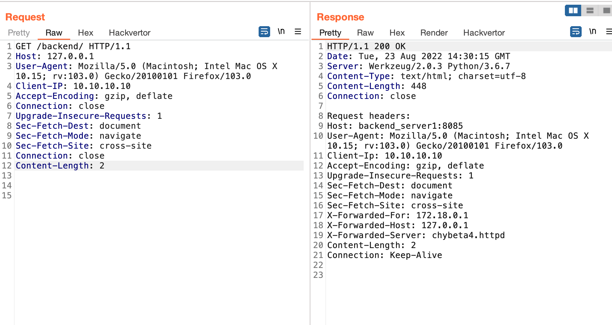
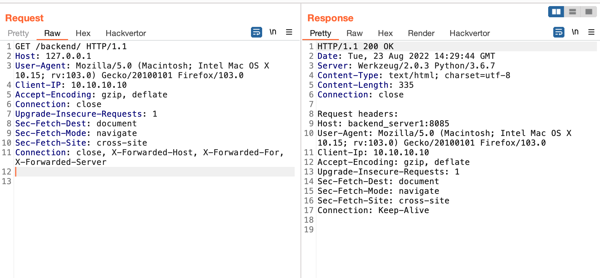

# README

```
./start.sh

# 关闭
docker-compose rm -fs
```







具体可参考 [Apache Module mod_proxy 场景绕过之三: CVE-2022-31813](https://articles.zsxq.com/id_c78wzuqs2pgm.html)

# Reference
https://httpd.apache.org/security/vulnerabilities_24.html